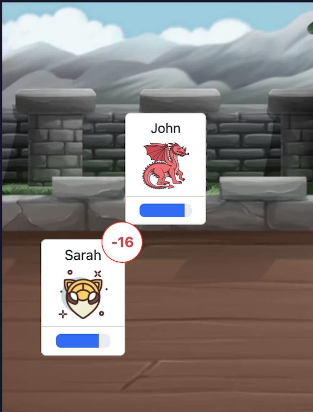
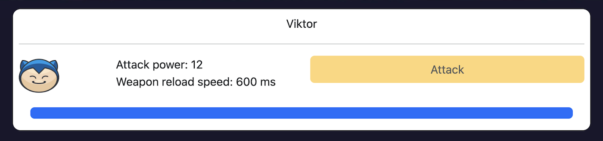

# Castle Bridge (Alpha)

Простая многопользовательская игра по типу сражения. Команда справа является командой героев, команда слева является злодеями. Цель игры победить противника. Побеждает та команда, в которой остался хотя бы один живой персонаж. 


## Запуск

```bash
# npm install
# npm run start
```

Далее отрыть игру [http://localhost:4200](http://localhost:4200), нажать на присоединиться к игре. Когда в игру зайдет первый игрок, начнется обратный
отсчет до того как заманда злодеев начнет атаковать команду героев. Так же игра начнется сразу если любой герой до окончания отсчета нанесет удар по противнику.

## Важные моменты
- Враги появлются каждый когда начинается игра в случайном порядке
- Обновление страницы сброссит вашу сессию и ваш персонаж покинет арену 
- Для атаки можно использовать клавишу пробел

## Получение урона
Когда персонаж получает урон, на него изображении появляется индикатор сколько единиц здоровья было получено.
Единицы силы удара назначаются в момент регистрации игрока и выбираются в случайном пордяке. 


## Нанесение урона
Для того что бы нанести удар, можно нажать клавишу пробел или нажать на кнопку attack. Следует учитывать, то после каждой атаки персонажу требуется время на подготовку следующего удара. 
Чем выше сила удара, тем больше времени требуется для подготовки следующего. 


